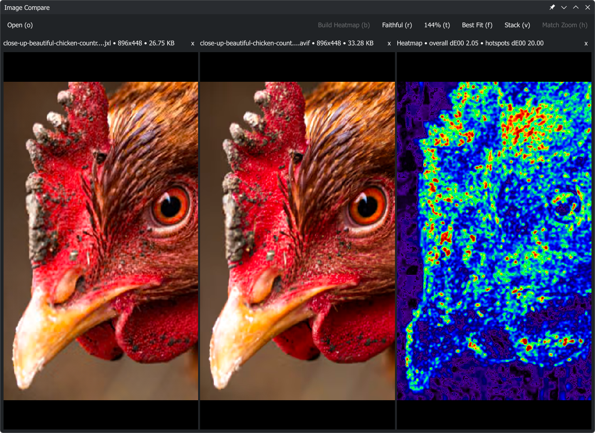

# Image Compare

Linux Image Comparison Program with various helpful features and tools.

## Demo



## Install

<a href='https://flathub.org/apps/details/io.github.gimletlove.imagecompare'></a>

[Arch (AUR)](https://aur.archlinux.org/packages/imagecompare-bin)

## Runtime Requirements

- Qt6 runtime libraries
- libvips runtime libraries

## How To Use

- Drag and drop files or use `Open` in the toolbar to import images from the file picker.
- Or pass image paths on the command line when launching the app.
- After installing the .desktop file, you can use `Open With` from your file manager to open selected images in Image Compare.
- `Build Heatmap` is available only when exactly two images are loaded and both have the same dimensions.
- `Faithful / Raw`: `Faithful` uses the embedded color profile when available; `Raw` ignores it.
- `Best Fit (f)` fits the images to their viewport.
- `Stack (v)` stacks the images so you can cycle between them with arrow keys.
- `Match Zoom (h)` normalizes zoom and panning between different image dimensions.


## Build Requirements

- C++20 compiler
- CMake 3.21+
- Qt6
- libvips & vips-cpp

```bash
pkg-config --modversion Qt6Core
pkg-config --modversion vips
pkg-config --modversion vips-cpp
```

## Build

```bash
cmake -S . -B build
cmake --build build
```

## Run

Open images directly on launch:

```bash
./build/imagecompare path/to/image.png path/to/another_image.png
```
