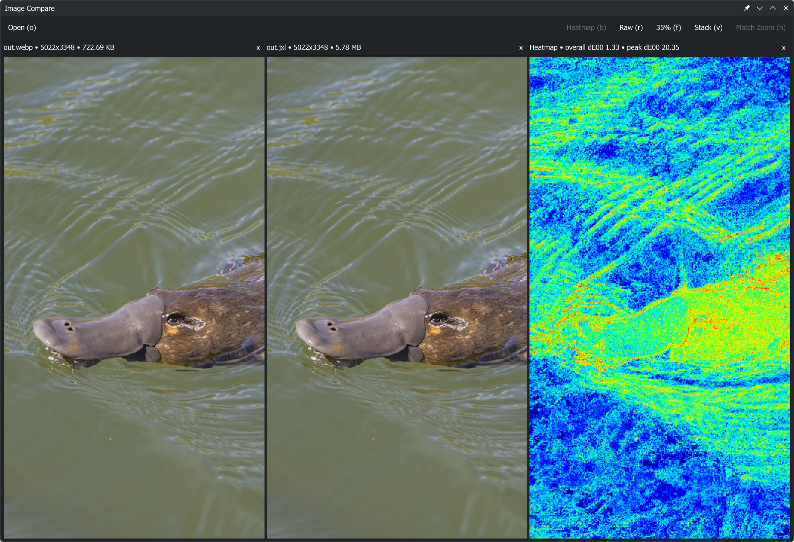

# Image Compare - Image Comparison & Visual Diff Tool for Linux and Windows

[](https://github.com/gimletlove/imagecompare/releases)
[](https://flathub.org/apps/details/io.github.gimletlove.imagecompare)
[](https://aur.archlinux.org/packages/imagecompare-bin)
[](./LICENSE.txt)

**Image Compare** is a desktop image comparison and visual diff tool for Linux and Windows. It compares two or more images side by side, in a stacked view, or in a grid layout, and can generate perceptual heatmaps to highlight visual differences between two images.

Use it to compare different versions of the same image, choose the best-quality copy from multiple sources, check compression artifacts, inspect scans or image exports, compare edited or upscaled versions, and catch subtle changes in color, sharpness, cropping, scaling, or encoding.

## Screenshot



## Features

- Open images with drag-and-drop, the file picker, command-line arguments, or file manager **Open With** actions
- Compare two or more images side by side, stacked, or in a grid layout
- Synchronize zoom and pan across all images
- Lock individual images to inspect them independently from synchronized images
- Use relative synchronization across different resolutions to keep the same proportional region visible
- Use stacked view to flip between images in the same position for quick comparison
- Generate and export perceptual heatmaps from two images to highlight subtle visual differences
- Switch between embedded color-profile rendering and raw rendering
- Copy image paths, open containing folders, move images, and close files from image context menus
- Load, zoom, and pan images efficiently with Qt6 and libvips

## Keyboard Shortcuts

| Shortcut | Action |
|---|---|
| `o` | Open images |
| `f` | Toggle best fit / 100% zoom |
| `v` | Toggle stacked view |
| Arrow keys | Cycle images in stacked view |
| `Enter` | Focus the active image |
| `h` | Toggle relative sync for different resolutions |
| `l` | Toggle synchronization lock for the active image |
| `r` | Toggle color-profile / raw rendering |
| `b` | Build heatmap |
| `Ctrl+W` | Close active image |
| `Ctrl+Left` / `Ctrl+Right` | Move image left / right |

## Install

### GitHub Releases

Download release builds from the [GitHub Releases page](https://github.com/gimletlove/imagecompare/releases).

Available release artifacts include:

- Linux DEB package for Debian and Ubuntu-based distributions
- Linux RPM package for Fedora and RPM-based distributions
- Linux install-tree zip
- Windows x86_64 portable zip
- Source tarball

### Flathub

```bash
flatpak install flathub io.github.gimletlove.imagecompare
```

### Arch Linux AUR

```bash
yay -S imagecompare-bin
```

### Windows

Download `imagecompare-<version>-windows-x86_64.zip` from GitHub Releases, extract it, and run `imagecompare.exe`.

The Windows build is distributed as a portable zip with its runtime dependencies bundled.

## Build from Source

Local source builds are intended for Linux. Windows packages are produced by the GitHub Actions release workflow.

Build requirements:

* C++20 compiler
* CMake 3.21+
* Qt6
* libvips and vips-cpp

Check installed dependency versions:

```bash
pkg-config --modversion Qt6Core
pkg-config --modversion vips
pkg-config --modversion vips-cpp
```

Build and run:

```bash
cmake -S . -B build
cmake --build build
./build/imagecompare
```

Flatpak builds can enable portal integration with:

```bash
cmake -S . -B build-flatpak -DIMAGECOMPARE_FLATPAK=ON
cmake --build build-flatpak
```

Flatpak builds also require Qt6 DBus and KDE Frameworks 6 CoreAddons.

## Project Links

- GitHub Releases: https://github.com/gimletlove/imagecompare/releases
- Flathub: https://flathub.org/apps/details/io.github.gimletlove.imagecompare
- Arch Linux AUR: https://aur.archlinux.org/packages/imagecompare-bin
